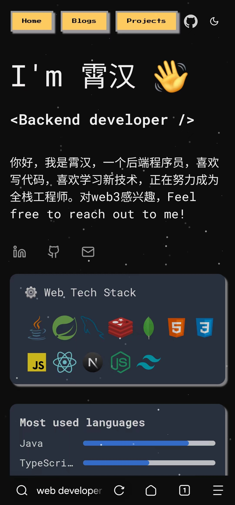
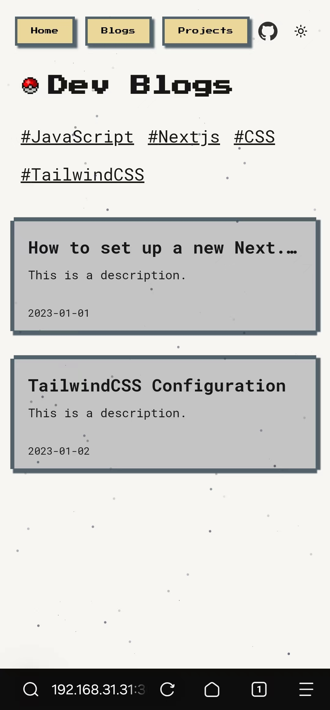
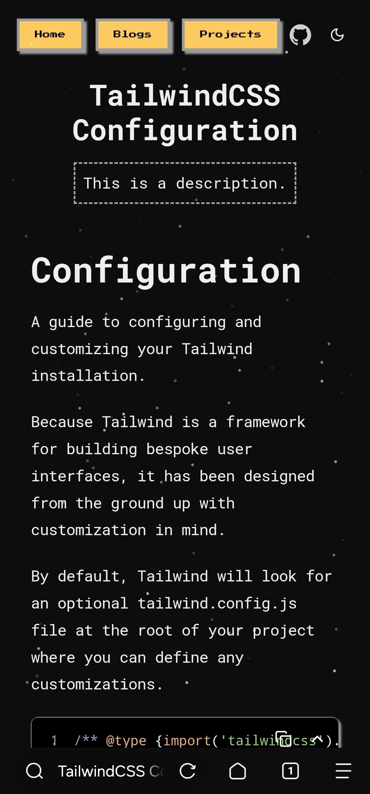

# Next.js TailwindCSS RemoteMDX 博客平台

一个后端程序员尝试学习前端，制作的基于 `Next.js`、 `TailwindCSS`、`next-remote-mdx` 的微像素风博客。

前端初学者，很多地方不完善，欢迎指正。

## 目录
- [简介](#简介)
- [功能特性](#功能特性)
- [安装与配置](#安装与配置)
- [开发](#开发)
- [文件结构](#文件结构)

## 简介

- **Markdown/MDX 支持**：支持 `.md` 和 `.mdx` 文件格式。
- **代码高亮**：使用 `rehype-prism-plus` 插件实现代码块高亮显示，支持单行代码高亮；
- **Markdown目录**：为标题标签（如 `h1`, `h2`）添加 ID，支持目录跳转。
- **多级目录内容支持**：markdown文件从本地读取，默认加载`examples`下的文件，支持多级文件夹结构，自动组装slug，访问对应的blog时解析找到对应文件。
- **Category/Tag筛选**：根据markdown `category` 和 `tag` 进行筛选，实现多级目录内容支持。
- **自定义Markdown组件**：自定义 markdown渲染组件；
- **黑白主题**：支持黑白主题切换。
- **响应式布局**：响应式布局，支持移动端访问。


<div style="display: flex;">



</div>


## 安装与配置


```bash
git clone https://github.com/your-repo/nextjs-blog.git
cd nextjs-blog
```

```bash
pnpm install
```

在项目根目录创建 `.env` 文件，并根据需要配置以下环境变量：

```env
BLOG_DIR=blogs  # 博客文件存放目录，默认为 "blogs"
```

将md、mdx文件放在blogs目录下即可访问；需配置好frontmatter，否则读取自动跳过
```ts
export type Frontmatter = {
    title: string;
    category: string;
    tags: string[];
    keywords?: string;
    publishedAt?: string;
    description?: string;
}
```

## 启动

启动：

```bash
pnpm dev
```

访问 [http://localhost:3000](http://localhost:3000) 查看博客平台。

## 文件结构

```
nextjs-blog/
├── examples/
│   └── 博客文件.md/mdx
├── public/
│   └── ...静态资源
├── src/
│   ├── app/
│   │   |── blogs/
│   │   └── projects/
│   ├── components/
│   │   └── ...React、Markdown 组件
│   ├── lib/
│   │   └── md.ts  # MDX 解析逻辑
│   ├── styles/
│   │   └── ...样式文件
│   ├── providers/
│   │   └── ThemeProvider.tsx
├── .env          # 环境变量配置
├── package.json  # 项目依赖
└── README.md     # 项目说明
```